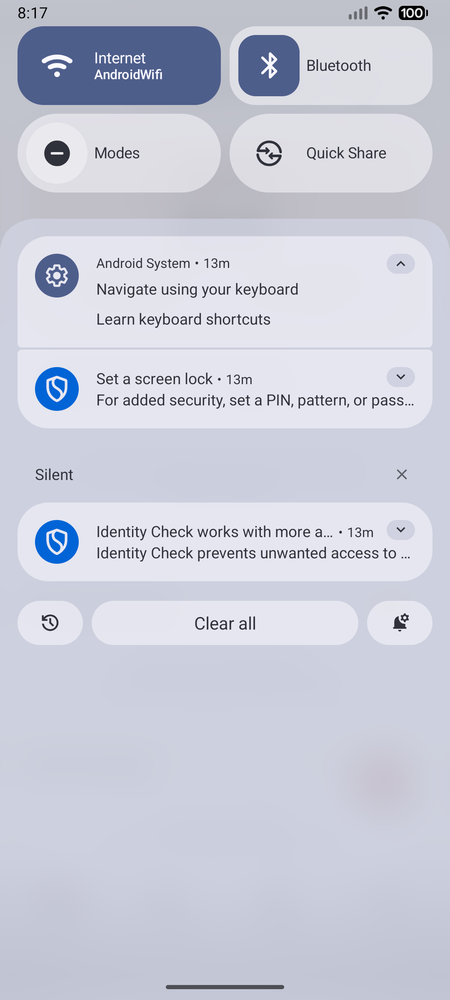

# Expense Tracker Android Application

A premium, modern, offline-first personal finance tracker built using **Jetpack Compose**, **Kotlin**, and **Room Database**. Designed with dynamic theme personalization, interactive budget gauges, and atomic transaction safety.

---

## 📱 Application Interface



---

## ✨ Key Features

*   **🎨 Dynamic Personalization & Settings**:
    *   **Custom Profiles**: Greet users with their custom profile names.
    *   **Flexible Currencies**: Support for symbol customization (`$`, `€`, `£`, `₹`, `¥`).
    *   **Theme Engine**: System, Light, and Dark mode selections.
    *   **Primary Accent Customization**: Sleek color palette swappers (Mint Green, Sky Blue, Coral Red, Sunny Yellow, Lavender Purple, Deep Slate, Cool Gray).
*   **💳 Multi-Account Bookkeeping**:
    *   Track checking, savings, cash, and credit card balances.
    *   Supports funds transfer operations between accounts.
*   **📊 Donut Chart Analytics**:
    *   Dynamic canvas-drawn expenditure analytics that displays category distribution percentages in real-time.
*   **📅 Smart Recurring Transactions**:
    *   Automate subscriptions, gym memberships, and payroll deposits.
    *   Features a **Catch-up Sync Loop** that calculates and posts missed transactions chronologically if the app hasn't been opened for multiple days.
*   **📈 Interactive Budgets**:
    *   Set monthly spending limits on categories (Food, Shopping, Utilities, Entertainment, etc.) and visually monitor gauges.
*   **🎯 Milestone Savings Goals**:
    *   Set target savings goals (e.g. Hawaii Vacation) with customizable deadlines and track contribution milestones.
*   **🔒 Atomic Database Transactions**:
    *   All complex multi-step state operations (e.g. transaction logging, account balance updates, budget adjustments, and fund transfers) are wrapped in Room `@Transaction` blocks to prevent database corruption.

---

## 🛠 Tech Stack

*   **Language**: [Kotlin](https://kotlinlang.org/)
*   **UI Framework**: [Jetpack Compose](https://developer.android.com/compose)
*   **Design System**: [Material 3](https://m3.material.io/)
*   **Local Storage**: [Room Database (SQLite)](https://developer.android.com/training/data-storage/room)
*   **Asynchronous Flow**: Kotlin Coroutines & Reactive Flows (`Flow`, `StateFlow`)
*   **Architecture**: MVVM (Model-View-ViewModel) with repository separation
*   **Unit Testing**: JUnit 4, Robolectric, and Mockito

---

## 🚀 Getting Started (Run Locally)

### Prerequisites
*   [Android Studio](https://developer.android.com/studio) (Ladybug / Koala or later recommended)
*   JDK 21 or later configured in Android Studio settings.

### Step-by-Step Installation

1.  **Clone the Repository**:
    ```bash
    git clone https://github.com/itsmeshibintmz/Expense_Tracker.git
    cd Expense_Tracker
    ```
2.  **Open in Android Studio**:
    *   Select **File > Open** and choose the directory of the cloned project.
    *   Allow Gradle sync to download all project dependencies.
3.  **Environment Settings**:
    *   Create a file named `.env` in the root directory.
    *   Provide your Gemini API Key in the `.env` file (see [`.env.example`](.env.example) for layout):
        ```env
        GEMINI_API_KEY=your_gemini_api_key_here
        ```
4.  **Signing Configuration**:
    *   *Optional*: If you encounter signing configuration warnings when deploying locally, remove the following line from your `app/build.gradle.kts` file:
        ```kotlin
        signingConfig = signingConfigs.getByName("debugConfig")
        ```
5.  **Build and Run**:
    *   Select an Emulator or a connected physical Android device.
    *   Click the **Run** button (green play arrow) or run using wrapper CLI:
        ```bash
        ./gradlew installDebug
        ```

---

## 📁 Project Architecture & Guidelines

```
app/src/main/java/com/example/
├── data/
│   ├── dao/
│   │   └── ExpenseDao.kt                 # Database access queries & transactional workflows
│   ├── database/
│   │   └── AppDatabase.kt                # Database builder (versioning & migrations)
│   ├── entity/
│   │   └── Entities.kt                   # Room DB Entities (Account, Budget, Goal, Transaction, RecurringEvent)
│   └── repository/
│       ├── ExpenseRepository.kt          # Prepopulated mock data & repository interface
│       └── UserPreferencesRepository.kt  # User profile preferences storage using SharedPreferences
├── ui/
│   ├── theme/
│   │   ├── Color.kt                      # System color palettes
│   │   ├── Theme.kt                      # Dynamic accent/theme mapper
│   │   └── Type.kt                       # Fonts and styles
│   ├── ExpenseViewModel.kt               # State flows and UI logic callbacks
│   └── ExpenseViewModelFactory.kt
└── MainActivity.kt                       # Composite forms, widgets, list renderers, and main app container
```

### Development Principles

*   **Atomic Updates**: Always wrap multi-entity mutations (e.g., adding a transaction and updating account balances) in Room `@Transaction` methods. Never execute sequential DAO modifications directly in repository coroutines to prevent partial state writes.
*   **Composition Overlap Focus Fix**: Read-only text fields used as dialog selectors should have click gestures intercepted by overlaying a sibling `Box(Modifier.matchParentSize().clickable { ... })` to prevent Compose focus interception.
*   **Mock Prepopulation**: When the database is newly initialized, mock statistics are prepopulated in `ExpenseRepository.prepopulateIfEmpty()` to showcase full dashboard functionality immediately.

---

## 📝 License

This project is open-source and available under the [MIT License](LICENSE).
